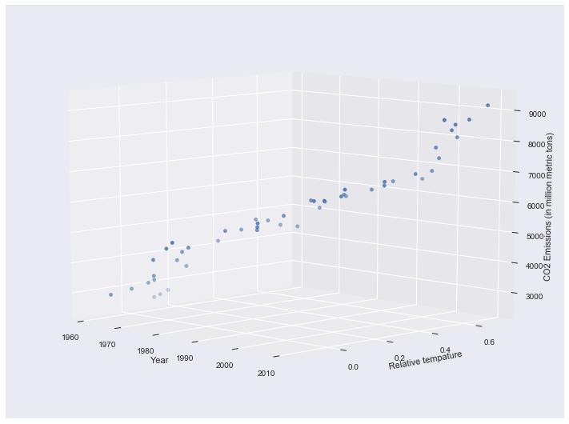
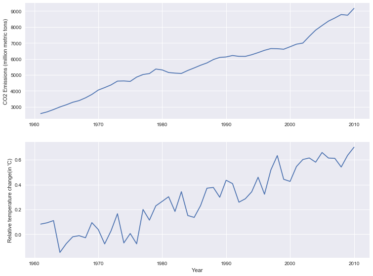
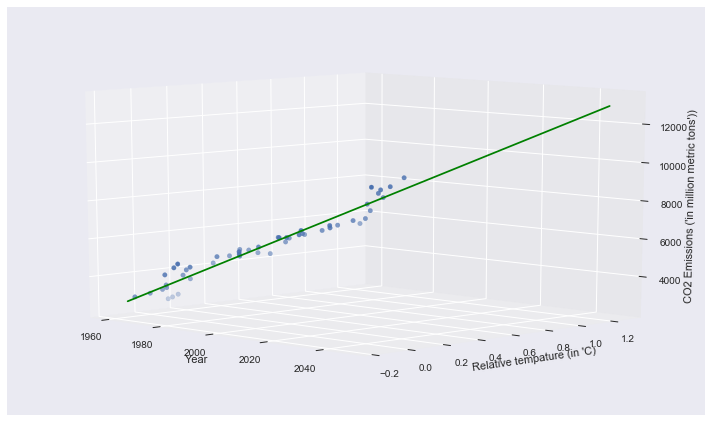
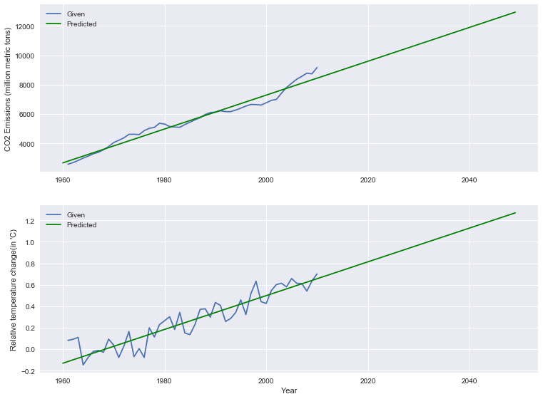

# Monitoring Global warming Linear Regression


## import libraries


```python
import pandas as pd
import numpy as np
import seaborn as sns
import matplotlib.pyplot as plt

#for static figures 
%matplotlib inline  

# for interactive figures 
# %matplotlib notebook     
```

## Load the Datasets and cleaning

[Link to global co2 dataset](http://data.okfn.org/data/core/co2-fossil-global) 

[Link to temperature datasets](http://data.okfn.org/data/core/global-temp)


```python
# co2 dataset

co2_df = pd.read_csv('global_co2.csv')
co2_df.head()
```


<div>
<table border="1" class="dataframe">
  <thead>
    <tr style="text-align: right;">
      <th></th>
      <th>Year</th>
      <th>Total</th>
      <th>Gas Fuel</th>
      <th>Liquid Fuel</th>
      <th>Solid Fuel</th>
      <th>Cement</th>
      <th>Gas Flaring</th>
      <th>Per Capita</th>
    </tr>
  </thead>
  <tbody>
    <tr>
      <th>0</th>
      <td>1751</td>
      <td>3</td>
      <td>0</td>
      <td>0</td>
      <td>3</td>
      <td>0</td>
      <td>0</td>
      <td>NaN</td>
    </tr>
    <tr>
      <th>1</th>
      <td>1752</td>
      <td>3</td>
      <td>0</td>
      <td>0</td>
      <td>3</td>
      <td>0</td>
      <td>0</td>
      <td>NaN</td>
    </tr>
    <tr>
      <th>2</th>
      <td>1753</td>
      <td>3</td>
      <td>0</td>
      <td>0</td>
      <td>3</td>
      <td>0</td>
      <td>0</td>
      <td>NaN</td>
    </tr>
    <tr>
      <th>3</th>
      <td>1754</td>
      <td>3</td>
      <td>0</td>
      <td>0</td>
      <td>3</td>
      <td>0</td>
      <td>0</td>
      <td>NaN</td>
    </tr>
    <tr>
      <th>4</th>
      <td>1755</td>
      <td>3</td>
      <td>0</td>
      <td>0</td>
      <td>3</td>
      <td>0</td>
      <td>0</td>
      <td>NaN</td>
    </tr>
  </tbody>
</table>
</div>


```python
# Cleaning the co2 datasts

co2_df = co2_df[co2_df.Year > 1960]      # Keep data in 1960-2010 
co2_df = co2_df.iloc[:,:2]               # Keep only total CO2  
co2_df.columns = ['Year','CO2']          # renaming the column names 
co2_df = co2_df.reset_index(drop=True)   # reset index to 0 
co2_df.head()
```


<div>
<table border="1" class="dataframe">
  <thead>
    <tr style="text-align: right;">
      <th></th>
      <th>Year</th>
      <th>CO2</th>
    </tr>
  </thead>
  <tbody>
    <tr>
      <th>0</th>
      <td>1961</td>
      <td>2580</td>
    </tr>
    <tr>
      <th>1</th>
      <td>1962</td>
      <td>2686</td>
    </tr>
    <tr>
      <th>2</th>
      <td>1963</td>
      <td>2833</td>
    </tr>
    <tr>
      <th>3</th>
      <td>1964</td>
      <td>2995</td>
    </tr>
    <tr>
      <th>4</th>
      <td>1965</td>
      <td>3130</td>
    </tr>
  </tbody>
</table>
</div>


```python
# temperature dataset

temp_df = pd.read_csv('annual_temp.csv')
temp_df.head()
```


<div>

<table border="1" class="dataframe">
  <thead>
    <tr style="text-align: right;">
      <th></th>
      <th>Source</th>
      <th>Year</th>
      <th>Mean</th>
    </tr>
  </thead>
  <tbody>
    <tr>
      <th>0</th>
      <td>GCAG</td>
      <td>2015</td>
      <td>0.8990</td>
    </tr>
    <tr>
      <th>1</th>
      <td>GISTEMP</td>
      <td>2015</td>
      <td>0.8700</td>
    </tr>
    <tr>
      <th>2</th>
      <td>GCAG</td>
      <td>2014</td>
      <td>0.7402</td>
    </tr>
    <tr>
      <th>3</th>
      <td>GISTEMP</td>
      <td>2014</td>
      <td>0.7500</td>
    </tr>
    <tr>
      <th>4</th>
      <td>GCAG</td>
      <td>2013</td>
      <td>0.6687</td>
    </tr>
  </tbody>
</table>
</div>


```python
# Cleaning temperature data

temp_df = temp_df[temp_df.Source != 'GISTEMP']          # Keeping only one source 'GCAG'
tempdf = temp_df.drop('Source',axis = 1,inplace=True)   # delete Source column 
temp_df = temp_df[temp_df.Year > 1960]                  # Keep data in 1960-2010 
temp_df = temp_df[temp_df.Year < 2011]                  # Keep data in 1960-2010 
temp_df = temp_df.reindex(index=temp_df.index[::-1])    # invert the columns
temp_df.columns = ['Year','Temperature']                # rename column names  
temp_df = temp_df.reset_index(drop=True)                # reset index to 0

temp_df.tail()
```


<div>

<table border="1" class="dataframe">
  <thead>
    <tr style="text-align: right;">
      <th></th>
      <th>Year</th>
      <th>Temperature</th>
    </tr>
  </thead>
  <tbody>
    <tr>
      <th>45</th>
      <td>2006</td>
      <td>0.6139</td>
    </tr>
    <tr>
      <th>46</th>
      <td>2007</td>
      <td>0.6113</td>
    </tr>
    <tr>
      <th>47</th>
      <td>2008</td>
      <td>0.5415</td>
    </tr>
    <tr>
      <th>48</th>
      <td>2009</td>
      <td>0.6354</td>
    </tr>
    <tr>
      <th>49</th>
      <td>2010</td>
      <td>0.7008</td>
    </tr>
  </tbody>
</table>
</div>


### concatenating  the datasets


```python
df = pd.concat([co2_df,temp_df.Temperature], axis=1)   # concatinate two datasets to one
df.head()
```


<div>

<table border="1" class="dataframe">
  <thead>
    <tr style="text-align: right;">
      <th></th>
      <th>Year</th>
      <th>CO2</th>
      <th>Temperature</th>
    </tr>
  </thead>
  <tbody>
    <tr>
      <th>0</th>
      <td>1961</td>
      <td>2580</td>
      <td>0.0818</td>
    </tr>
    <tr>
      <th>1</th>
      <td>1962</td>
      <td>2686</td>
      <td>0.0924</td>
    </tr>
    <tr>
      <th>2</th>
      <td>1963</td>
      <td>2833</td>
      <td>0.1100</td>
    </tr>
    <tr>
      <th>3</th>
      <td>1964</td>
      <td>2995</td>
      <td>-0.1461</td>
    </tr>
    <tr>
      <th>4</th>
      <td>1965</td>
      <td>3130</td>
      <td>-0.0752</td>
    </tr>
  </tbody>
</table>
</div>


```python
from mpl_toolkits.mplot3d import Axes3D             # matplotlib library for 3d plot 
fig = plt.figure()                                  
fig.set_size_inches(12.5, 9.5)                      # setting figure size
ax = fig.add_subplot(111, projection='3d')
ax.scatter(xs= df['Year'],ys=df['Temperature'],zs = df['CO2']) # scatter plot
ax.set_ylabel('Relative tempature'); ax.set_xlabel('Year'); ax.set_zlabel('CO2 Emissions (in million metric tons)')
ax.view_init(10, -45)     # for setting the appropiate view 
```





```python
# 2d plots
fig = plt.figure()
fig.set_size_inches(12.5, 9.5)

plt.subplot(2, 1, 1)
plt.plot(df['Year'],df['CO2'])
plt.ylabel('CO2 Emissions (million metric tons)')

plt.subplot(2, 1, 2)
plt.plot(df['Year'],df['Temperature'])
plt.xlabel('Year')
plt.ylabel("Relative temperature change(in 'C)")

plt.show()
```





## Linear regression


```python
from sklearn.linear_model import LinearRegression
from sklearn.model_selection import train_test_split
```


```python
X = df.as_matrix(['Year'])                                           # feature as matrix
y = df.as_matrix(['CO2','Temperature']).astype('float32')            # two labels as matrix 

X_train,X_test,y_train,y_test = train_test_split(X,y,test_size= 0.1)   # split the dataset with 10% test data 

```


```python
reg = LinearRegression()                  # start the clasifier
reg.fit(X_train,y_train)                  # fit the model
```


    LinearRegression(copy_X=True, fit_intercept=True, n_jobs=1, normalize=False)


```python
print('Score :' ,reg.score(X_test.reshape(-1,1),y_test))    # Accuracy score on test data
```

    ('Score :', 0.94463171177086991)


```python
x_line = np.arange(1960,2050).reshape(-1,1)                 # lining Year upto 2050
p = reg.predict(x_line).T                                   # predict the labels 
```

## 3d Plots


```python
fig2 = plt.figure()
fig2.set_size_inches(12.5, 7.5)
ax = fig2.add_subplot(111, projection='3d')
ax.scatter(xs=df['Year'], ys=df['Temperature'], zs=df['CO2'])
ax.set_ylabel("Relative tempature (in 'C)"); ax.set_xlabel('Year'); ax.set_zlabel("CO2 Emissions ('in million metric tons'))")
ax.plot(xs=x_line, ys=p[1], zs=p[0], color='green')        # predicted line 
ax.view_init(10, -45)
```





## projected 2d plot


```python
# 2d plots
fig = plt.figure()
fig.set_size_inches(12.5, 9.5)

plt.subplot(2, 1, 1)
plt.plot(df['Year'],df['CO2'],label='Given')
plt.plot(x_line,p[0], color='green',label='Predicted')
plt.ylabel('CO2 Emissions (million metric tons)')
plt.legend()


plt.subplot(2, 1, 2)
plt.plot(df['Year'],df['Temperature'],label='Given')
plt.plot(x_line,p[1], color='green',label='Predicted')
plt.xlabel('Year')
plt.ylabel("Relative temperature change(in 'C)")
plt.legend()

plt.show()
```





# Don’t make our earth garbage; save it from global warming.
